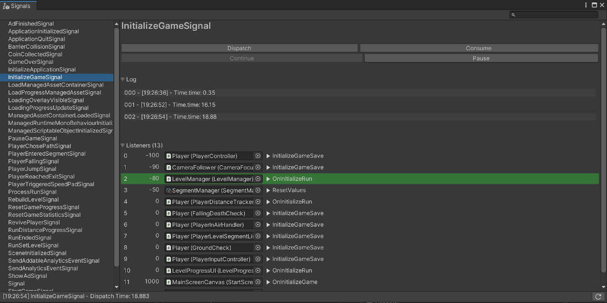

# Signals ❇



### A typesafe, lightweight, tested messaging package for Unity.  
[](https://openupm.com/packages/com.supyrb.signals/)
---

## Installation

### Simple Download

[Latest Unity Packages](../../releases/latest)

### Unity Package Manager (UPM)

> You will need to have git installed and set in your system PATH.

Find `Packages/manifest.json` in your project and add the following:
```json
{
  "dependencies": {
    "com.supyrb.signals": "https://github.com/supyrb/signals.git#0.5.0",
    "...": "..."
  }
}
```

### OpenUPM

Install the package with [OpenUPM](https://openupm.com/) through the commandline

```sh
# Install openupm-cli
$ npm install -g openupm-cli

# Enter your unity project folder
$ cd YOUR_UNITY_PROJECT_FOLDER

# Add package to your project
$ openupm add com.supyrb.signals
```

## Features

* Signal Hub as a global Registry for everyone to access
* Signal with up to three parameters
* Signal Listener Order
* Consuming Signals
* Pausing Signals

As well as
* An editor window
  * A filterable list of all signals in the project
  * Dispatch signals with custom parameters
  * A signal log for each signal
  * List of all subscribed listeners for a signal
* Easy integration with UPM
* Unit tests for runtime scripts
* Sample packages to get started fast
* XML comments for all public methods and properties

## Usage

[BasicExample](./Samples~/Basic/Scripts/BasicExampleSignalTest.cs)

### Get Signal

```c#
Signals.Get(out exampleSignal);
```
or
```c#
exampleSignal = Signals.Get<BasicExampleSignal>();
```
or
```c#
exampleSignal = Signals.Get(typeof(BasicExampleSignal));
```

### Subscribe to Signal

```c#
// Default subscription with order 0
exampleSignal.AddListener(DefaultListener);
// Subscribe with an earlier order to be called first
exampleSignal.AddListener(FirstListener, -100);
```

### Dispatch Signal

```c#
exampleSignal.Dispatch();
```
### Pause & Continue

```c#
exampleSignal.Pause();
exampleSignal.Continue();
```
If you want to pause the further propagation of a signal (wait for a *user input*/*scene that needs to laod*/*network package*) you can easily do that with `signal.Pause()` and `signal.Continue()`.

### Consume Signals

```c#
exampleSignal.Consume();
```
Sometimes only one script should handle a signal or the signal should not reach others. Unity for example does this with keystrokes in the editor, you can decide in the script if the [event is used](https://docs.unity3d.com/ScriptReference/Event.Use.html). Similar to that, you can consume signals with `signal.Consume()`. Always be away of the order of your listeners. Listeners with a lower order value are called first and therefore decide before others if they should get the event as well.

## Editor Window

The editor window can be accessed through `Window->Signals`. It is a work in progress, but already adds quite some value to the package. If you would like to use the package without the editor window, the last valid version for that is `0.3.1`

* On the first start and whenever you added a signal you want to debug, just hit the refresh button in the bottom right corner of the window
* In the top right corner there is a search field which you can use to filter your signals
* Click on a signal in the list, to see the details of that signal

### Detail View

* You can dispatch, consume, pause and continue the signal. For dispatching you will get the needed fields to enter your custom arguments. Most common types are supported, for non supported types you will see an information.
* The log shows a history of all dispatched of that signal with a timestamp of the real time all well as the game time of that dispatch
* The Listeners list shows all subscribed methods to that signal sorted with their order. Additionally the listeners are colored if the last dispatch is at a certain listener
  * Green: The signal is currently running at this listener
  * Yellow: The signal was paused at this listener
  * Red: The signal was consumed at this listener

## Contribute

Contributions to the repository are always welcome. There are several ways to contribute:  
* [Create an issue](../../issues) for a problem you found or an idea on how to improve the project
* Solve existing issues with PRs
* Write test cases to make sure everything is running the way it is supposed to run
* Create CI actions (e.g. run automated tests, trigger new version creation)
* Refactor / Cleanup code
* Document code functionality
* Write wiki entries
* Improve editor integration of signals
* Post your thoughts in the [Unity Forum](https://forum.unity.com/threads/open-source-signals-a-decoupled-typesafe-messaging-system.803487/)

### Code Contribution

#### Setup

1. Create a new Unity Project
2. Clone git repository in your assets folder `C:\UnityProject\Assets> git clone hhtps://github.com/supyrb/signals.git`
3. Copy folder `UnityProject\Assets\Signals\Samples~` to `UnityProject\Assets\SignalSamples` in order to see/use the examples

#### Guidelines

* Use Tabs
* Use namespace `Supyrb`
* Use private fields with `[SerializeField]` when you need to expose fields in the editor
* Use [XML comments](https://docs.microsoft.com/en-us/dotnet/csharp/codedoc) for public methods and classes
* Follow the [Supyrb Guidelines](https://github.com/supyrb/SupyrbConventions) in your code.
* Use present tense git commits as described [here](https://github.com/supyrb/SupyrbConventions/tree/develop/git#commit-messages)
* Use reflection for the editor window to access data from the signals, do not change field visibility just for editor tools.

## Credits

* Built on the shoulders of [Signals](https://github.com/yankooliveira/signals) by [Yanko Oliveira](https://github.com/yankooliveira)
* Inspired by the great wisdom of [Benny Berger](https://github.com/Asorano)
* Inspired by [JS-Signas](https://github.com/millermedeiros/js-signals) by [Miller Medeiros](https://github.com/millermedeiros)
* Developed by [Johannes Deml](https://github.com/JohannesDeml) – [public@deml.io](mailto:public@deml.io)

## License

* MIT - see [LICENSE](./LICENSE.md)

**
